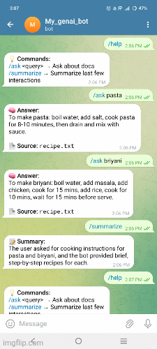

# Telegram Bot Suite  
### 🧠 Text Q&A (RAG) + 🖼️ Image Captioning with BLIP  

A multi-capability Telegram bot powered by **Google Gemini 2.5 Flash** and **Salesforce BLIP** for intelligent text and image understanding.  
Built for both **text-based question answering (RAG)** and **image caption generation**.

---

## 🎬 Demo

 for Text/Summarize
 for Text and image 

---

## 📂 Project Structure

| Folder | Description |
|--------|--------------|
| **`text_rag_bot** | Text-only Gemini RAG bot for Q&A and summarization. |
| **`text_image_bot** | Extended version with image captioning (Gemini + BLIP). |
| **`assets** | Contains example images, demo GIFs. |

---

## 🧩 1️⃣ Text-Only (Gemini RAG Bot)

A lightweight Telegram bot that performs contextual Q&A and summarization using **Gemini 2.5 Flash** and **Vertex AI Embeddings**.

| Type | File Name | Description |
|------|------------|--------------|
| 🐍 Python Script | `bot_text_rag.py` | Handles `/ask`, `/summarize`, and other text-based tasks. |
| 📘 README | `README_text_rag.md` | Full setup guide and usage documentation. |

📖 **Learn more:** [README_text_rag.md](README_text_rag.md)

---

## 🖼️ 2️⃣ Text + Image Captioning (Gemini + BLIP Bot)

An upgraded bot version that supports **image uploads**.  
Images are analyzed locally using **Salesforce BLIP** (for captioning), while Gemini handles all **text reasoning** and retrieval.

| Type | File Name | Description |
|------|------------|--------------|
|  Python Script | `bot_text_image_caption.py` | Unified bot with `/ask`, `/summarize`, and image upload captioning. |
| 📘 README | `README_text_image.md` | Step-by-step guide for installing and running the text+image bot. |

 **Learn more:** [README_text_image.md](README_text_image_caption.md)

---

## 🧠 Tech Stack Overview

| Component | Technology |
|------------|-------------|
| **LLM** | Google Gemini 2.5 Flash |
| **Image Model** | Salesforce BLIP (Hugging Face Transformers) |
| **Embeddings** | Vertex AI `text-embedding-005` |
| **Vector Store** | FAISS |
| **Bot Framework** | python-telegram-bot (async) |
| **Cloud** | Google Cloud Vertex AI / Local Environment |

---

##  Installation (Quick Start)

```bash
# 1️⃣ Clone the repository
git clone https://github.com/yourusername/gemini-telegram-bot.git
cd gemini-telegram-bot

# 2️⃣ Install dependencies
pip install -r requirements.txt

# 3️⃣ Add your credentials
export GOOGLE_API_KEY="your-gemini-api-key"
export TELEGRAM_TOKEN="your-telegram-bot-token"

# 4️⃣ Run the bot
python bot_text_rag.py
# or for image + text
python bot_text_image_caption.py
